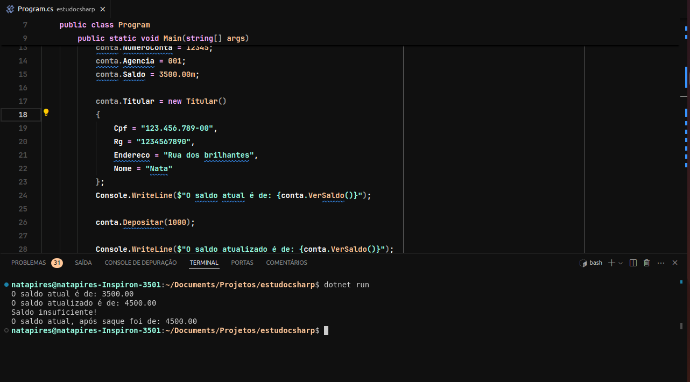

# Sistema Bancário em C#

<p align="center">
  <a href="#-tecnologias">Tecnologias</a>&nbsp;&nbsp;&nbsp;|&nbsp;&nbsp;&nbsp;
  <a href="#-projeto">Projeto</a>&nbsp;&nbsp;&nbsp;|&nbsp;&nbsp;&nbsp;
  <a href="#-layout">Layout</a>&nbsp;&nbsp;&nbsp;
</p>

<p align="center">
  
</p>

<br>

Este projeto é um exemplo de um sistema bancário simples em C#, criado como um estudo de caso. O sistema permite criar contas bancárias, verificar saldos, depositar e sacar valores.

## Estrutura do Projeto

O projeto é dividido em duas principais partes:

1. **Namespace `estudocsharp.SistemaBanco`**:
    - **Classe `Conta`**: Representa uma conta bancária com as seguintes propriedades:
        - `Agencia`: Número da agência.
        - `NumeroConta`: Número da conta.
        - `NomeConta`: Nome do titular da conta.
        - `Titular`: Informações do titular da conta (utiliza a classe `Titular`).
        - `Saldo`: Saldo atual da conta.
    - **Métodos da Classe `Conta`**:
        - `VerSaldo()`: Retorna o saldo atual da conta.
        - `Depositar(decimal valor)`: Adiciona o valor especificado ao saldo da conta.
        - `Sacar(decimal valor)`: Subtrai o valor especificado do saldo da conta se houver saldo suficiente.
    - **Classe `Titular`**: Representa o titular da conta com as seguintes propriedades:
        - `Nome`: Nome do titular.
        - `Cpf`: CPF do titular.
        - `Rg`: RG do titular.
        - `Endereco`: Endereço do titular.

2. **Namespace `estudocsharp`**:
    - **Classe `Program`**: Classe principal que contém o método `Main`, responsável por executar o programa. Esta classe demonstra a criação de uma conta bancária, e as operações de depósito e saque.

## Funcionalidades

### 1. Criar uma Conta Bancária
No método `Main`, é criada uma nova instância da classe `Conta` e são atribuídos valores às suas propriedades:

```csharp
var conta = new SistemaBanco.Conta();
conta.NomeConta = "Nata";
conta.NumeroConta = 12345;
conta.Agencia = 1;
conta.Saldo = 3500.00m;
conta.Titular = new SistemaBanco.Titular()
{
    Cpf = "123.456.789-00",
    Rg = "1234567890",
    Endereco = "Rua dos brilhantes",
    Nome = "Nata"
};
```

### 2. Verificar Saldo
A função `VerSaldo` é chamada para exibir o saldo atual da conta:

```csharp
Console.WriteLine($"O saldo atual é de: {conta.VerSaldo()}");
```

### 3. Depositar Valores
A função `Depositar` é usada para adicionar um valor ao saldo da conta:

```csharp
conta.Depositar(1000m);
Console.WriteLine($"O saldo atualizado é de: {conta.VerSaldo()}");
```

### 4. Sacar Valores
A função `Sacar` é utilizada para subtrair um valor do saldo da conta, se houver saldo suficiente:

```csharp
conta.Sacar(6000m);
Console.WriteLine($"O saldo atual, após saque foi de: {conta.VerSaldo()}");

conta.Sacar(2000m);
Console.WriteLine($"O saldo atualizado é de: {conta.VerSaldo()}");
```

## Como Executar

1. Clone o repositório para o seu ambiente local.
2. Abra o projeto em uma IDE que suporte C# (como Visual Studio ou Visual Studio Code).
3. Compile e execute o projeto.

```bash
dotnet build
dotnet run
```
<br>
<p align="center">
  
</p>

## Contribuições

Sinta-se à vontade para contribuir com melhorias e novas funcionalidades para este projeto. Faça um fork do repositório, crie um branch para a sua funcionalidade e abra um pull request.

## Licença

Este projeto está licenciado sob a Licença MIT. Consulte o arquivo LICENSE para obter mais detalhes.

---
## 🛠 Tecnologias

Esse projeto foi desenvolvido com as seguintes tecnologias:

- C#, .NET
- Git & Github

## 💻 Projeto

Feito com ♥ by Natã Pires :wave: [Entre em contato pelo Linkedln](https://www.linkedin.com/in/natapiresferreira/)